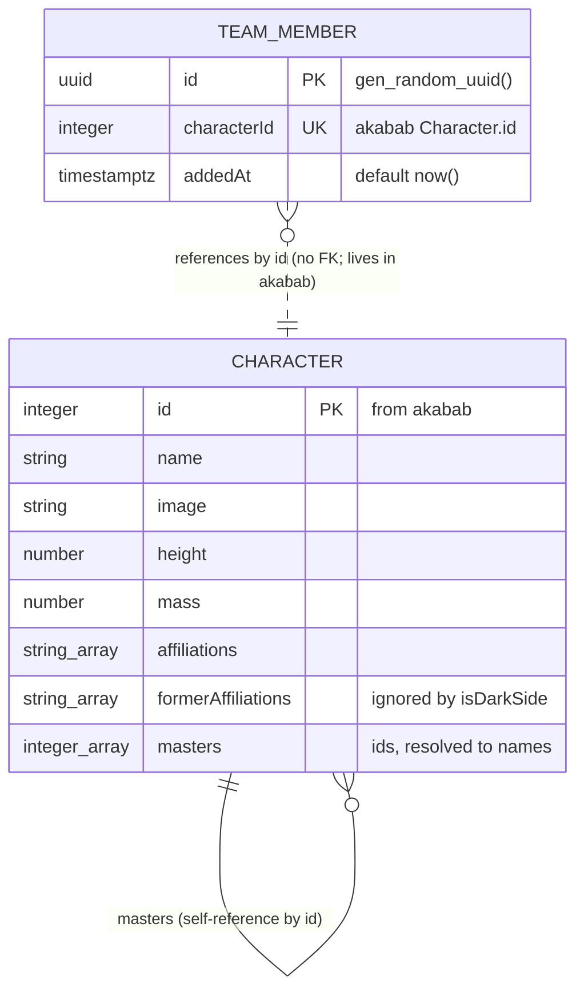

# Data model, Whale Star Wars Team Builder

## Overview



The dotted line is the soft reference: `team_members.characterId` points at an `akabab` character, but there is no database foreign key because the character row lives outside our database. The service validates existence by fetching `/id/{id}.json` before insert.

## `TeamMember`

Persisted in Postgres via Drizzle. Defined in `apps/platform/src/db/schema.ts`, the only file that imports `drizzle-orm/pg-core`.

| Column        | Type          | Default      | Notes                                                                    |
| ------------- | ------------- | ------------ | ------------------------------------------------------------------------ |
| `id`          | `uuid`        | `gen_random_uuid()` | Primary key. App never reads this in business logic, but the API exposes it. |
| `characterId` | `integer`     | (none)       | Unique. Matches `akabab` `Character.id`. No FK (character lives outside our DB). |
| `addedAt`     | `timestamptz` | `now()`      | Used for stable sort in `GET /api/team` (oldest first).                  |

Indexes:

- `team_members_character_id_unique` on `characterId` (also enforces the dedupe rule that surfaces as `409 ALREADY_MEMBER`).

The Drizzle table name is `team_members` (snake_case in SQL, camelCase in TS via the column mapping).

## `Character`

Read-only, fetched from `akabab` (`/all.json` for the list, `/id/{id}.json` for detail and the server-side evil check). Types are generated by Kubb from `plans/contracts/starwars.openapi.yaml`.

Fields the app actually reads:

| Field                | Type        | Used by                       |
| -------------------- | ----------- | ----------------------------- |
| `id`                 | `number`    | routing, `TeamMember.characterId`, list prev/next |
| `name`               | `string`    | list, detail header, `isDarkSide` rule 1 |
| `image`              | `string`    | list thumbnail, detail hero   |
| `height`             | `number`    | detail page                   |
| `mass`               | `number`    | detail page                   |
| `affiliations`       | `string[]`  | detail page, `isDarkSide` rule 2  |
| `formerAffiliations` | `string[]`  | deliberately ignored by `isDarkSide` (kept on the type so the field is visible, not so it's used) |
| `masters`            | `number[]`  | `isDarkSide` rule 3 (resolved to names server-side) |

Other `akabab` fields are present on the generated type but unused. The UI does not invent fields the spec doesn't list.

## Invariants

| Invariant                                          | Enforced in                                | Surfaces as            |
| -------------------------------------------------- | ------------------------------------------ | ---------------------- |
| `count(team_members) <= 5`                         | `TeamService.add()` (read, check, insert in a transaction) | `422 TEAM_FULL`        |
| `characterId` unique across `team_members`         | DB unique index, double-checked by service | `409 ALREADY_MEMBER`   |
| Evil characters cannot be added                    | `TeamService.add()` calls `isDarkSide()` after fetching the character from `akabab` | `422 EVIL_FORBIDDEN`  |
| Character must exist in `akabab`                   | `TeamService.add()` fetches `/id/{id}.json` first | `404 NOT_FOUND` if `akabab` 404s |

The five-member cap lives in the service, not as a DB check, so the failure surfaces as a typed API error rather than a generic constraint violation.

## Derived predicate: `isDarkSide(character, masterNames)`

Single implementation at `apps/platform/src/lib/darkSide.ts`, imported by both `TeamService` (server guard) and the UI (Add button disable + tooltip). Pure, synchronous, no fetching inside.

Signature:

```ts
isDarkSide(character: Character, masterNames: ReadonlyMap<number, string>): boolean
```

`masterNames` maps `Character.id` to `Character.name` for any id that appears in `character.masters`. Both call sites build it once before calling:

- **UI** builds it from the cached `/all.json` list.
- **Server** builds it by fetching the masters it needs from `akabab` (or by reusing a request-scoped cache).

Three rules, OR'd together:

1. `character.name` contains `"Darth"` or `"Sith"` (case-insensitive).
2. Any entry in `character.affiliations` contains `"Darth"` or `"Sith"` (case-insensitive). `formerAffiliations` is ignored on purpose: a character who left the Sith is not currently evil.
3. Any id in `character.masters` resolves through `masterNames` to a name containing `"Darth"`.
