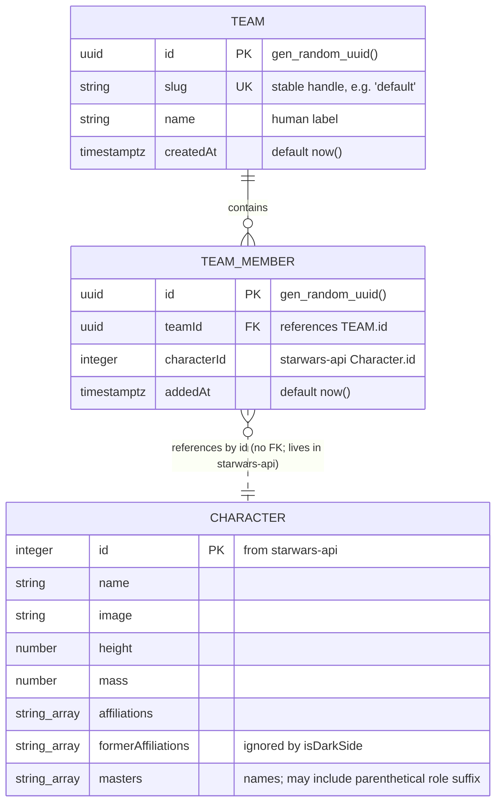

# Data model, Whale Star Wars Team Builder

## Overview



The dotted line is the soft reference: `team_members.characterId` points at a `starwars-api` character, but there is no database foreign key because the character row lives outside our database. The service validates existence by fetching `/id/{id}.json` before insert.

For now the app operates against a single seeded **default team** (`slug = 'default'`). The `Team` table exists so the multi-team case is a future addition, not a schema migration; every service call resolves the default team id once at startup and threads it through. `(teamId, characterId)` is unique, so the same character can never appear twice in the same team. The five-member cap is per-team.

## `Team`

Persisted in Postgres via Drizzle. Defined in `apps/platform/src/db/schema.ts`.

| Column      | Type          | Default               | Notes                                                                          |
| ----------- | ------------- | --------------------- | ------------------------------------------------------------------------------ |
| `id`        | `uuid`        | `gen_random_uuid()`   | Primary key.                                                                   |
| `slug`      | `text`        | (none)                | Unique stable handle. The seed migration inserts `slug = 'default'`.           |
| `name`      | `text`        | (none)                | Human label, e.g. `"Default team"`.                                            |
| `createdAt` | `timestamptz` | `now()`               | Bookkeeping.                                                                   |

Indexes:

- `teams_slug_unique` on `slug`.

The Drizzle table name is `teams`. A single seed row (`slug = 'default'`) is inserted as part of the initial migration so the app always has somewhere to put members.

## `TeamMember`

Persisted in Postgres via Drizzle. Defined in `apps/platform/src/db/schema.ts`, the only file that imports `drizzle-orm/pg-core`.

| Column        | Type          | Default             | Notes                                                                              |
| ------------- | ------------- | ------------------- | ---------------------------------------------------------------------------------- |
| `id`          | `uuid`        | `gen_random_uuid()` | Primary key. App never reads this in business logic, but the API exposes it.        |
| `teamId`      | `uuid`        | (none)              | FK to `teams.id` with `ON DELETE CASCADE`. Always the default team for now.        |
| `characterId` | `integer`     | (none)              | Matches `starwars-api` `Character.id`. No FK (character lives outside our DB).            |
| `addedAt`     | `timestamptz` | `now()`             | Used for stable sort in `GET /api/team` (oldest first).                            |

Indexes:

- `team_members_team_id_character_id_unique` on `(teamId, characterId)` (enforces the dedupe rule that surfaces as `409 ALREADY_MEMBER`).
- `team_members_team_id_idx` on `teamId` (every list query filters by it).

The Drizzle table name is `team_members` (snake_case in SQL, camelCase in TS via the column mapping).

## `Character`

Read-only. The browser fetches characters from our own `/api/characters` and `/api/characters/{id}`; behind those routes the server proxies `starwars-api` (`/all.json`, `/id/{id}.json`) and reuses the same response for the server-side evil check.

Two Kubb-generated types, one per side of the proxy:

- **Frontend**: `Character` is generated from `plans/contracts/api.openapi.yaml` alongside the documented `listCharacters` and `getCharacter` operations. Every browser-side component and the generated RTK Query endpoints import it from there.
- **Server**: the source-API shape is generated from `plans/contracts/starwars.openapi.yaml`. Only the proxy fetcher touches it; the route handlers downconvert it to the frontend `Character` before responding.

Fields the app actually reads (identical on both sides of the proxy, the `starwars-api` just carries extra ones we drop):

| Field                | Type        | Used by                       |
| -------------------- | ----------- | ----------------------------- |
| `id`                 | `number`    | routing, `TeamMember.characterId`, list prev/next |
| `name`               | `string`    | list, detail header, `isDarkSide` rule 1 |
| `image`              | `string`    | list thumbnail, detail hero   |
| `height`             | `number`    | detail page                   |
| `mass`               | `number`    | detail page                   |
| `affiliations`       | `string[]`  | detail page, `isDarkSide` rule 2  |
| `formerAffiliations` | `string[]`  | deliberately ignored by `isDarkSide` (kept on the type so the field is visible, not so it's used) |
| `masters`            | `string[]`  | `isDarkSide` rule 3. Names already (may carry a parenthetical role like `"Darth Sidious (Sith Master)"`); substring check still works. |

Other `starwars-api` fields are present on the server-side generated type but are stripped by the proxy before the response leaves the server. The UI does not invent fields the contract doesn't list.

## Invariants

| Invariant                                          | Enforced in                                | Surfaces as            |
| -------------------------------------------------- | ------------------------------------------ | ---------------------- |
| `count(team_members where teamId = :default) <= 5` | `TeamService.add()` (read, check, insert in a transaction) | `422 TEAM_FULL`        |
| `(teamId, characterId)` unique across `team_members` | DB composite unique index, double-checked by service | `409 ALREADY_MEMBER`   |
| Default team row exists                            | Seeded by the initial migration; resolved once at service construction | startup error if missing |
| Evil characters cannot be added                    | `TeamService.add()` calls `isDarkSide()` after fetching the character from `starwars-api` | `422 EVIL_FORBIDDEN`  |
| Character must exist in `starwars-api`                   | `TeamService.add()` fetches `/id/{id}.json` first | `404 NOT_FOUND` if `starwars-api` 404s |

The five-member cap lives in the service, not as a DB check, so the failure surfaces as a typed API error rather than a generic constraint violation.

## Derived predicate: `isDarkSide(character)`

Single implementation at `apps/platform/src/lib/darkSide.ts`, imported by both `TeamService` (server guard) and the UI (Add button disable + tooltip). Pure, synchronous, no fetching inside.

Signature:

```ts
isDarkSide(character: Character): boolean
```

`character.masters` is already `string[]` on the source API (sometimes with a parenthetical role suffix like `"Darth Sidious (Sith Master)"`), so no id-to-name resolution is needed.

Three rules, OR'd together:

1. `character.name` contains `"Darth"` or `"Sith"` (case-insensitive).
2. Any entry in `character.affiliations` contains `"Darth"` or `"Sith"` (case-insensitive). `formerAffiliations` is ignored on purpose: a character who left the Sith is not currently evil.
3. Any entry in `character.masters` contains `"Darth"` (case-insensitive).
