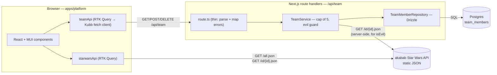

# Implementation Plan: Whale Star Wars Team Builder

## Summary

Transform the current `TypeScript` library monorepo into a `Next.js` app that browses Star Wars characters from `akabab` and lets the user assemble a max-5 team while excluding evil characters. Characters are fetched directly from `akabab` via `RTK Query`. Only the team persists, in `Postgres` via `Drizzle`, served by our own `Next.js` route handlers behind a `Repository` → `Service` → handler layering.

`Kubb` generates types and `Zod` schemas for both APIs from hand-written `OpenAPI` specs. Work ships across six independently runnable phase files in `/plans/`.

## Phase Map

- **Planning Phases (0 / 1 / 2)** — produce docs in `plans/` (`spec.md`, `research.md`, `data-model.md`, `contracts/*.yaml`, `quickstart.md`, and the six slice files). No code.
- **Execution Slices (001 – 006)** — produce code. Each boots from a fresh `pnpm install` and ends in a demoable state.
- Headings are prefixed `Planning Phase N` vs `Slice 00X` throughout so the two tracks never collide.
- Status tags used in Progress Tracking: `todo` · `in-progress` · `blocked` · `done`.

## Technical Context

| Field            | Value                                                                                          |
| ---------------- | ---------------------------------------------------------------------------------------------- |
| Language/Version | `TypeScript` 6.x, Node 22, ESM-only                                                            |
| Frontend         | `Next.js` (latest, App Router), `React` (Next-bundled), `MUI v7` with `AppRouterCacheProvider` |
| State / Data     | `Redux Toolkit`, `RTK Query`                                                                   |
| Codegen          | `Kubb 5.0.0-beta.23` (`adapter-oas`, `plugin-ts`, `plugin-client`, `plugin-zod`)               |
| Storage          | `Postgres 17` via `Drizzle ORM` + `drizzle-kit`, `pg` driver                                   |
| Testing          | `Vitest` (unit + integration), `Playwright` (e2e), `Testing Library` (components)              |
| Tooling          | `pnpm` workspaces, `Turborepo`, `tsdown`, `oxlint`, `oxfmt`, `Changesets`                      |
| Project Type     | Web — monorepo with `apps/platform` + shared `packages/`                                       |

## Constitution Check

- **Layered architecture** — Route handler → `Service` → `Repository` → `Drizzle`. Each layer has exactly one concern. The `Repository` is the **only** place `Drizzle` is imported.
- **Contract-first** — `OpenAPI 3.1` specs for both our team API and `akabab` precede generated code; `Kubb` is the source of truth for types and `Zod`.
- **Test-first where it pays** — Service rules (cap of 5, evil guard) and the `isEvil` util get unit/integration tests **before** UI work in their phase. Pure presentational components do not block on tests.
- **Independent phases** — Each `plans/00X-*.md` boots from a fresh `pnpm install` and ends in a runnable, demoable state.
- **No premature abstraction** — Components live in `packages/components` only once a second consumer exists or they're explicitly part of the design system shell (sidebar, card). Otherwise they stay in `apps/platform`.

## Data flow



## Project Structure

```
apps/platform/
  src/
    app/                          # App Router pages + /api/team handlers
    store/                        # Redux store, starwarsApi, teamApi
    server/
      repositories/               # Drizzle only
      services/                   # rules: cap of 5, evil guard
    db/                           # schema, client, migrations
    gen/                          # Kubb output: team/ + starwars/ (gitignored)
    lib/                          # evil rules, helpers
  tests/                          # Vitest
  e2e/                            # Playwright
  kubb.config.ts
  openapi/
    team.yaml
    starwars.yaml
  drizzle.config.ts
packages/components/              # MUI building blocks
internals/utils/                  # already present
configs/                          # already present
```

`packages/core` and `packages/demo` are deleted in Phase 2/001.

## Planning Phase 0: Outline & Research

**Output**: `plans/spec.md`, `plans/research.md`.

### Research items (questions resolved with the user, recorded in `research.md`)

| Question                          | Decision                                                                                     | Rationale                                                                                         |
| --------------------------------- | -------------------------------------------------------------------------------------------- | ------------------------------------------------------------------------------------------------- |
| Where does character data live?   | Direct `akabab` calls from `RTK Query`                                                       | The prompt doesn't require character persistence; proxying adds latency and no value               |
| Where does the team live?         | `Postgres` via `Drizzle`, single shared team, no auth                                        | Matches a coding-test scope; exercises the `Repository`/`Service` layering the prompt requires     |
| What does `Kubb` generate?        | Both APIs: `team.yaml` → types + client + `Zod`; `starwars.yaml` → types + `Zod` (no client) | The prompt mandates `Kubb`; `starwars` skips the client plugin since `RTK Query` does the fetching |
| `Next.js` routing?                | App Router                                                                                   | Current default; pairs with `AppRouterCacheProvider` for `MUI v7`                                 |
| Where does the `Next.js` app sit? | `apps/platform`; shared components in `packages/components`                                  | Explicit instruction in the prompt                                                                 |
| Cleanup?                          | Delete `packages/core` and `packages/demo`                                                   | Unused template scaffolding                                                                       |

### Spec content (`plans/spec.md`)

- **User scenarios** — Browse, view a character, add/remove to the team, see the team from anywhere, manage from `/team`.
- **Functional requirements** — FR-1..FR-7 mirroring the prompt's bullet list. Each FR is testable.
- **Key entities** — `Character` (read-only, from `akabab`), `TeamMember` (writeable, owned by us).
- **Acceptance** — Every requirement bullet from the prompt becomes a row in the acceptance checklist.

## Planning Phase 1: Design & Contracts

**Output**: `plans/data-model.md`, `plans/contracts/*.yaml`, `plans/quickstart.md`.

### Data model (`plans/data-model.md`)

- **`TeamMember`** — `id uuid pk`, `characterId int unique`, `addedAt timestamptz default now`. Invariant: `count(*) <= 5`, enforced in the service. No FK to character (character lives in `akabab`).
- **`Character`** — read-only mirror of `akabab`'s shape. Fields used: `id`, `name`, `image`, `height`, `mass`, `affiliations`, `formerAffiliations`, `masters`. Derived predicate: `isEvil(character)` per the prompt's three rules.

### Contracts

- **`plans/contracts/team.openapi.yaml`** — `OpenAPI 3.1` for our team API:
  - `GET /api/team` → `TeamMember[]`
  - `POST /api/team` `{ characterId }` → `TeamMember`, with `409 ALREADY_MEMBER`, `422 TEAM_FULL`, `422 EVIL_FORBIDDEN`, `404 NOT_FOUND`
  - `DELETE /api/team/{characterId}` → 204
- **`plans/contracts/starwars.openapi.yaml`** — `OpenAPI 3.1` describing the `akabab` JSON:
  - `GET /all.json` → `Character[]`
  - `GET /id/{id}.json` → `Character`

These specs are checked into `plans/contracts/` and copied to `apps/platform/openapi/` when Phases 003 and 004 run.

### Quickstart (`plans/quickstart.md`)

Six user-flow scenarios, one per acceptance criterion:

1. List loads at `/`.
2. Detail page shows name/image/height/mass/affiliations.
3. Prev/next navigates the list.
4. Add and remove from the detail page.
5. Sidebar reflects the team on every page; `/team` lists and removes.
6. Sixth add is refused; Vader's Add is disabled with tooltip.

## Planning Phase 2: Task split into Execution Slices

The slice files in `plans/00X-*.md` are this feature's `tasks.md` equivalent, split so each one boots independently per the prompt. They share a skeleton (Context, Goal, Prerequisites, Steps, Files touched, Verification, Done criteria) defined once in [`plans/template.md`](./template.md). Copy that file when adding a new slice.

### Task ordering and parallelism

- **001 → 002** is sequential (the app must exist before DB wiring).
- **002 and Planning Phase 1 contracts** can be authored in parallel `[P]`.
- **003** depends on 002 and the team contract.
- **004** depends on 003 (it consumes `team.yaml`) and can land alongside Planning Phase 1's `starwars.yaml` `[P]` for the second `Kubb` pipeline.
- **005** depends on 004 (it consumes the generated types).
- **006** depends on 005 (e2e drives real flows).

### Execution Slices (one file each)

| Slice file                 | Depends on                              | Demoable outcome                                                                                                                                                                                  |
| -------------------------- | --------------------------------------- | ------------------------------------------------------------------------------------------------------------------------------------------------------------------------------------------------- |
| `plans/001-setup.md`       | —                                       | `pnpm dev` serves an `MUI`-themed `Next.js` page at `localhost:3000`. `pnpm typecheck`/`lint`/`test` green. `packages/core` and `packages/demo` removed.                                          |
| `plans/002-database.md`    | 001                                     | `docker compose up -d postgres && pnpm --filter platform db:migrate` creates `team_members`. Repository CRUD covered by `Vitest` integration tests against a real `Postgres`.                     |
| `plans/003-api.md`         | 002 + Planning Phase 1 `team.yaml`      | `/api/team` route handlers wired through `Service` + `Repository`. `isEvil` stub returns `false` with a `TODO(005)`. Duplicate POST → 409. Sixth POST → 422 `TEAM_FULL`. Integration tests green. |
| `plans/004-client-kubb.md` | 003 + Planning Phase 1 `starwars.yaml`  | `pnpm --filter platform gen` produces `src/gen/team/` (types + client + `Zod`) and `src/gen/starwars/` (types + `Zod`). `store.ts` wires `starwarsApi` and `teamApi` into `<Providers>`.          |
| `plans/005-features.md`    | 004                                     | All UI requirements live: list, detail with prev/next, persistent `<TeamSidebar />`, `/team`, real `isEvil`, evil-Add disabled. `Vitest` covers `isEvil` and key components.                      |
| `plans/006-testing.md`     | 005                                     | `Playwright` specs cover browse/team/cap/evil. CI runs `Postgres` service container, migrations, unit + integration + e2e. One `Changesets` entry.                                                |

## Complexity Tracking

| Item                                         | Justification                                                                                                                                        |
| -------------------------------------------- | ---------------------------------------------------------------------------------------------------------------------------------------------------- |
| Two `OpenAPI` specs instead of one           | The prompt mandates `Kubb`; without a spec for `akabab`, hand-written types would diverge from the generated team types. Cost: one extra `yaml` file. |
| `Drizzle` + `Postgres` for a single team row | The prompt explicitly requires the `DB` → `Repository` → `Service` → API layering. A simpler in-memory store would not satisfy that.                  |
| `packages/components` from day one           | The prompt asks for it. Initial cost is one placeholder export; real components arrive in Phase 005.                                                  |

## Progress Tracking

### Planning Phase 0 — Outline & Research

- [x] `plans/spec.md` — _done_ — user scenarios + FR-1..FR-7 + acceptance checklist
- [x] `plans/research.md` — _done_ — 6-row decisions table moved out of `plan.md`

### Planning Phase 1 — Design & Contracts

- [ ] `plans/data-model.md` — _todo_ — `TeamMember` + `Character` + invariants
- [x] `plans/contracts/team.openapi.yaml` — _done_ — our team API spec (paths, error codes, and `TeamMember` schema from plan.md)
- [x] `plans/contracts/starwars.openapi.yaml` — _done_ — `akabab` spec inferred from samples (`/all.json`, `/id/{id}.json`, full `Character` schema)
- [ ] `plans/quickstart.md` — _todo_ — 6 user-flow scenarios

### Planning Phase 2 — Slice files authored

- [ ] `plans/001-setup.md` — _todo_
- [ ] `plans/002-database.md` — _todo_
- [ ] `plans/003-api.md` — _todo_
- [ ] `plans/004-client-kubb.md` — _todo_
- [ ] `plans/005-features.md` — _todo_
- [ ] `plans/006-testing.md` — _todo_

### Execution Slices (each ends in a demoable state)

- [ ] **001-setup** — _todo_ — depends on: — — `pnpm dev` boots MUI Next.js page; templates removed
- [ ] **002-database** — _todo_ — depends on: 001 — `db:migrate` creates `team_members`; repo CRUD integration-tested
- [ ] **003-api** — _todo_ — depends on: 002, Planning Phase 1 team contract — `/api/team` handlers + Service + Repository; 409/422 paths green
- [ ] **004-client-kubb** — _todo_ — depends on: 003, Planning Phase 1 starwars contract — `pnpm gen` emits `src/gen/`; RTK Query wired
- [ ] **005-features** — _todo_ — depends on: 004 — list, detail (prev/next), `<TeamSidebar />`, `/team`, real `isEvil`
- [ ] **006-testing** — _todo_ — depends on: 005 — Playwright e2e; CI runs Postgres + migrations + unit + integration + e2e

### Closeout

- [ ] Global verification — _todo_ — `quickstart.md` walked end-to-end against a clean checkout
- [ ] `Changesets` entry — _todo_
- [ ] `README.md` updated — _todo_ — tech stack, use cases, folder structure

## Evil rule (referenced from Phase 1's `data-model.md` and Phase 005)

A character is evil if any of:

1. `name` contains "Darth" or "Sith" (case-insensitive).
2. A current `affiliation` mentions "Darth" or "Sith". `formerAffiliations` are ignored.
3. A `master` resolves to a name containing "Darth".

`src/lib/evil.ts` is the single implementation, imported by both the service guard and the UI.

## Open items to confirm during execution

- `akabab` images come from an external CDN; Phase 001 allows them via `next.config.ts` `images.remotePatterns`.
- `openapi/starwars.yaml` is inferred from sample `akabab` payloads. If reality diverges, the spec gets a follow-up and `pnpm gen` re-emits types.
- "Single shared team" means concurrent users overwrite each other. Last write wins; `RTK Query` tags drive invalidation.
