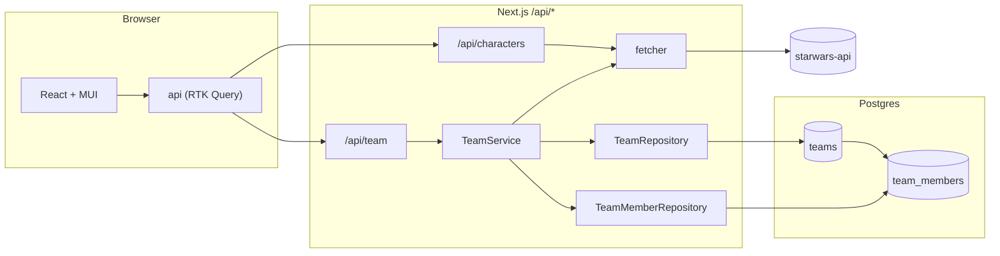

# Plan: Star Wars Team Builder

## Summary

Transform the current `TypeScript` library monorepo into a `Next.js` app that browses Star Wars characters and lets the user assemble a team.

The browser talks to a single `Next.js` API. Character endpoints are a server-side proxy in front of `starwars-api`; team endpoints persist in `Postgres` via `Drizzle`. The schema has two tables: `teams` (seeded with a single `default` row) and `team_members`. The app uses the default team everywhere, so multi-team is a future feature, not a migration.

`Kubb` generates one frontend client + `Zod` from `plans/starwars-team-builder/contracts/api.openapi.yaml`. That contract documents every endpoint the browser calls (characters proxy routes and team routes), so the frontend has a fully generated client and never imports `starwars.openapi.yaml`. A second pipeline against `plans/starwars-team-builder/contracts/starwars.openapi.yaml` emits server-only types + `Zod` for the source-API shape used by the proxy fetcher.

## Phases

- **Planning Phases**: produce md files in `plans/starwars-team-builder/` (`spec.md`, `research.md`, `data-model.md`, `contracts/*.yaml`, `verification.md`, `design.md`, and the slice files).
- **Execution Slices**: produce code. Each boots from a fresh `pnpm install` and ends in a demoable state.

## Technical Context

| Field            | Value                                                                                                                      |
| ---------------- | -------------------------------------------------------------------------------------------------------------------------- |
| Language/Version | `TypeScript` `^6.0.3`, Node 22, ESM-only                                                                                   |
| Frontend         | `Next.js` ^`16.2.6` (App Router), `React` 19, `MUI` (^`9.0.1`)                                                             |
| State            | `@reduxjs/toolkit` `^2.12.0`, `react-redux` `^9.3.0`, `RTK Query`                                                          |
| Codegen          | `Kubb` `5.0.0-beta.23` (`adapter-oas`, `plugin-ts`, `plugin-client`, `plugin-zod`)                                         |
| Storage          | `Postgres 17` via `drizzle-orm` `^0.45.2` + `drizzle-kit` `^0.31.10`, `pg` `^8.21.0` driver (`@types/pg` `^8.20.0`)        |
| Testing          | `Vitest` `^4.1.6` (unit + integration), `@playwright/test` `^1.60.0` (e2e), `Testing Library` (components)                 |
| Tooling          | `pnpm` `11.1.3`, `turbo` `^2.9.14`, `tsdown` `^0.22.0`, `oxlint` `^1.66.0`, `oxfmt` `^0.47.0`, `@changesets/cli` `^2.31.0` |
| Project Type     | Web monorepo with `apps/platform` + shared `packages/`                                                                     |

## Ground Rules

- **Layered architecture**: Route handler → `Service` → `Repository` → `DB`. Each layer has exactly one concern.\
  `Drizzle` imports are restricted to `apps/platform/src/db/**` (schema + client) and `apps/platform/src/server/repositories/**` (queries). No other directory imports it — services, routes, components, and tests all go through repositories.

- **Contract-first**: One `OpenAPI 3.1` spec for the frontend-facing API (`api.openapi.yaml`, documents `/api/characters`, `/api/characters/{id}`, `/api/team*` and the shared `Character` schema) and one for `starwars-api` (server-only).\
  `Kubb` is the source of truth for types and `Zod`. The frontend never imports the `starwars-api` contract.

- **Test-first approach**: Service rules and the `isDarkSide` util get unit/integration tests **before** UI work in their phase. Pure presentational components do not block on tests.
- **Independent phases**: Each `plans/starwars-team-builder/00X-*.md` boots from a fresh `pnpm install` and ends in a runnable, demoable state.
- **Components in** `packages/components` **from day one**: every UI component listed in `design.md`'s inventory lives in `packages/components`. `apps/platform/src/components` is reserved for app-level wiring (route layouts, providers) that isn't itself a reusable component.

## Data flow



## Project Structure

```text
apps/platform/
  src/
    app/                          # App Router pages + /api/characters and /api/team handlers
    store/                        # Redux store, single `api` RTK Query slice
    server/
      repositories/               # Drizzle only
      services/                   # rules: cap of 5, evil guard
      starwars-api.ts             # `starwars-api` fetcher, request-scoped cache, server-only
    db/                           # schema, client, migrations
    gen/                          # Kubb output: api/ (frontend) + starwars/ (server, gitignored)
    lib/                          # evil rules, helpers
  # Tests colocate next to source: foo.ts ↔ foo.test.ts
  e2e/                            # Playwright
  kubb.config.ts
  openapi/
    api.yaml                      # frontend-facing contract (proxy + team)
    starwars.yaml                 # `starwars-api` contract, server-only
  drizzle.config.ts
packages/components/
  src/
    shell/                        # AppShell, TopBar
    characters/                   # CharacterCard, CharacterList, CharacterDetail
    team/                         # TeamSidebar, TeamSidebarContainer, TeamMemberRow
    common/                       # StatePanel, ActionButton, Pill, Pager, ProgressDots, Tooltip
    index.ts                      # single top-level barrel; no per-feature index.ts files
internals/utils/                  # already present
configs/                          # already present
```

`packages/core` and `packages/demo` are deleted in Phase 2/001.

## Planning Phase 0: Outline & Research

**Output**: `plans/starwars-team-builder/spec.md`, `plans/starwars-team-builder/research.md`.

See those files for the resolved questions, scenarios, functional requirements, and acceptance checklist.

## Planning Phase 1: Design & Contracts

**Output**: `plans/starwars-team-builder/data-model.md`, `plans/starwars-team-builder/contracts/api.openapi.yaml`, `plans/starwars-team-builder/contracts/starwars.openapi.yaml`, `plans/starwars-team-builder/verification.md`.

The contract specs are checked into `plans/starwars-team-builder/contracts/` and copied to `apps/platform/openapi/` when Slice 004 (mirrors `api.yaml`) and Slice 005 (mirrors `starwars.yaml`) run.

## Planning Phase 2: Task split into Execution Slices

The slice files in `plans/starwars-team-builder/00X-*.md` are this feature's `tasks.md` equivalent. They share the canonical skeleton at `plans/templates/slice.md`.

### Execution Slices (one file each)

| Slice file                 | Depends on                                          | Demoable outcome                                                                                                                                                                                                                             |
| -------------------------- | --------------------------------------------------- | -------------------------------------------------------------------------------------------------------------------------------------------------------------------------------------------------------------------------------------------- |
| `plans/starwars-team-builder/001-setup.md`       | none                                                | `pnpm dev` serves an `MUI`-themed `Next.js` page at `localhost:3000`. `pnpm typecheck`/`lint`/`test` green. `packages/core` and `packages/demo` removed.                                                                                     |
| `plans/starwars-team-builder/002-database.md`    | 001                                                 | `docker compose up -d postgres && turbo run db:migrate` creates `teams` and `team_members` and seeds the default team. Repository CRUD covered by `Vitest` integration tests against a real `Postgres`.                         |
| `plans/starwars-team-builder/003-design.md`      | 001                                                 | Design tokens land in the `MUI` theme (palette, typography, spacing, radius). `packages/components` exports the layout shell (`<AppShell />`, `<TeamSidebar />` placeholder, `<CharacterCard />`, `<StatePanel />` for loading/empty/error). |
| `plans/starwars-team-builder/004-api.md`         | 002 + Planning Phase 1 `api.yaml` + `starwars.yaml` | `/api/characters` and `/api/team` route handlers. Proxy uses a server-only `starwars-api` fetcher; team handlers go through `Service` + `Repository`                                                                                         |
| `plans/starwars-team-builder/005-client-kubb.md` | 003 + 004                                           | `turbo run gen` produces `src/gen/api/` (types + client + `Zod`) and `src/gen/starwars/` (types + `Zod`, server-only). `store.ts` wires the single `api` RTK Query slice into `<Providers>`.                                    |
| `plans/starwars-team-builder/006-features.md`    | 005                                                 | All UI requirements live: list, detail with prev/next, persistent `<TeamSidebar />`, `/team`, real `isDarkSide`, evil-Add disabled. Screens built from the 003 components. `Vitest` covers `isDarkSide` and key components.                  |
| `plans/starwars-team-builder/007-testing.md`     | 006                                                 | `Playwright` specs cover browse/team/cap/evil. CI runs `Postgres` service container, migrations, unit + integration + e2e. One `Changesets` entry.                                                                                           |

## Planning Phase 3: Frontend Design

**Output**: `plans/starwars-team-builder/design.md` plus optional artifacts under `plans/starwars-team-builder/design/`.

**Visual reference**: [usewhale.io](https://usewhale.io/). The brand is corporate-clean: Whale pink (`#FF348A`) on white, generous whitespace, ~8px radius, subtle elevation, sans-serif throughout.

Three passes:

1. **ASCII (required).** Sketch the three screens and the layout shell directly in `plans/starwars-team-builder/design.md`.
2. **Claude design (optional).** Generate mockups via Claude's frontend-design / Artifacts when visual questions remain. Drop into `plans/starwars-team-builder/design/`.
3. **Wireframes (optional, formal).** Produce responsive wireframes with state coverage. Drop into `plans/starwars-team-builder/design/`.

Gate for Slice 003: `plans/starwars-team-builder/design.md` has tokens, layout shell, one sketch per screen, component inventory, state matrix.

## Complexity Tracking

| Item                                         | Justification                                                                                                                                                                                                                                            |
| -------------------------------------------- | -------------------------------------------------------------------------------------------------------------------------------------------------------------------------------------------------------------------------------------------------------- |
| Two `OpenAPI` specs instead of one           | One contract for the frontend (`api.yaml`, every endpoint the browser calls plus the shared schemas), one for the source API (server-only, used to type the proxy fetcher). The browser depends on a single contract and never sees the source-API spec. |
| Server-side proxy for character data         | Avoids leaking the source-API URL to the browser, lets us cache and rate-limit centrally, and keeps the frontend on a single contract and a single generated client.                                                                                     |
| `Drizzle` + `Postgres` for a single team row | The prompt explicitly requires the `DB` → `Repository` → `Service` → API layering. A simpler in-memory store would not satisfy that.                                                                                                                     |
| `packages/components` holds all UI           | The prompt asks for it. We put every UI component there from the start (no single-consumer carve-out) so imports never have to move later. `apps/platform/src/components` is reserved for non-reusable app wiring.                                       |

## Progress Tracking

### Planning Phase 0: Outline & Research

- [x] `plans/starwars-team-builder/spec.md`: done, user scenarios + FR-1..FR-7 + acceptance checklist
- [x] `plans/starwars-team-builder/research.md`: done, 6-row decisions table moved out of `plan.md`

### Planning Phase 1: Design & Contracts

- [x] `plans/starwars-team-builder/data-model.md`: done, `TeamMember` columns + `Character` fields + invariants + `isDarkSide` rules
- [x] `plans/starwars-team-builder/contracts/api.openapi.yaml`: done, the single frontend-facing spec covering `/api/characters`, `/api/characters/{id}`, `/api/team*`, and the shared `Character` schema
- [x] `plans/starwars-team-builder/contracts/starwars.openapi.yaml`: done, `starwars-api` spec, server-only (used by the proxy fetcher's types)
- [x] `plans/starwars-team-builder/verification.md`: done, 6 user-flow scenarios mapped to AC-1..AC-9

### Planning Phase 2: Slice files authored

- [x] `plans/starwars-team-builder/001-setup.md`: done
- [x] `plans/starwars-team-builder/002-database.md`: done
- [x] `plans/starwars-team-builder/003-design.md`: done
- [x] `plans/starwars-team-builder/004-api.md`: done
- [x] `plans/starwars-team-builder/005-client-kubb.md`: done
- [x] `plans/starwars-team-builder/006-features.md`: done
- [x] `plans/starwars-team-builder/007-testing.md`: done

### Planning Phase 3: Frontend Design

- [x] `plans/starwars-team-builder/design.md`: done. ASCII pass: tokens + layout shell + three screen sketches + component inventory + state matrix
- [x] `plans/starwars-team-builder/design/` hi-fi mockups: done. `home.html`, `character-detail.html`, `team.html` generated via Claude design from the tokens in `design.md`

### Execution Slices (each ends in a demoable state)

- [ ] **001-setup**: todo
- [ ] **002-database**: todo
- [ ] **003-design**: todo
- [ ] **004-api**: todo
- [ ] **005-client-kubb**: todo
- [ ] **006-features**: todo
- [ ] **007-testing**: todo

### Final checks

- [ ] Global verification, `verification.md` walked end-to-end against a clean checkout
- [ ] `Changesets` entry
- [ ] `README.md` updated, tech stack, use cases, folder structure
- [ ] `AGENTS.md` / `CLAUDE.md` refreshed:
  - New scripts: `dev`, `db:migrate`, `db:generate`, `db:studio`, `gen`, `test`, `test:e2e`
  - New workspace layout: `apps/platform`, `packages/components`; `packages/core` and `packages/demo` removed
  - Skill notes: Drizzle in repositories only, Kubb's regen step, the `isDarkSide` single-implementation rule
- [ ] `plans/starwars-team-builder/research.md` open items closed or moved to follow-up issues
